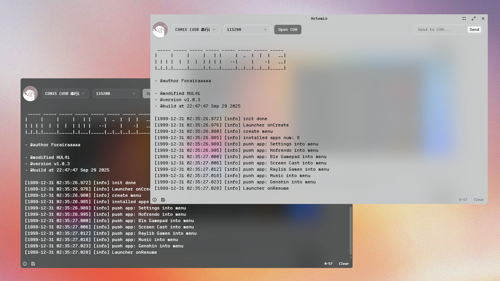
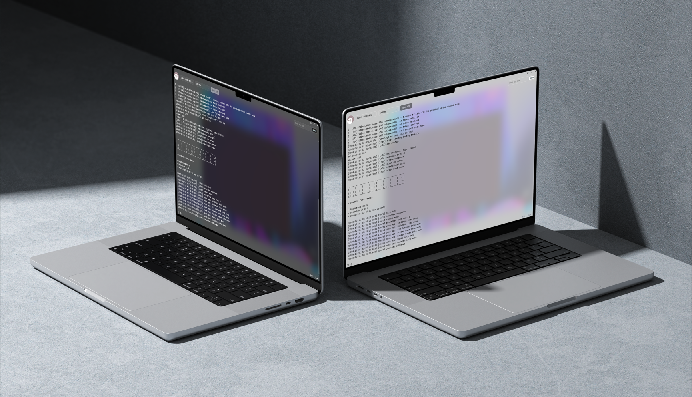

# Artemis - CrossPlatform, Modern UI Serial Monitor
<p align="center">
   
</p>

<h1 align="center">Artemis - Cross-Platform Serial Monitor</h1>
<p align="center">
    <em>Artemis 是一款使用 Tauri 2 构建的跨平台串口监视器，拥有现代化的用户界面和丰富的功能。</em>
</p>
<p align="center">
    <a href="">
        
    </a>
    <a href="">
        
    </a>
    <a href="">
        
    </a>
    <a href="">
        
    </a>
    <a href="https://github.com/me-shaon/GLWTPL/blob/master/LICENSE">
        
    </a>
    <a href="https://github.com/me-shaon/GLWTPL/blob/master/LICENSE">
        
    </a>
</p>

<p align="center">
   
</p>


## 🚀 特性

- **跨平台支持**：基于 Tauri 2 构建，支持 Windows、macOS 和 Linux
- **现代化 UI**：采用流畅的设计语言，提供优秀的用户体验
- **明暗主题切换**：支持 light/dark mode，适应不同的使用环境
- **个性化设置**：简单的设置选项，让你在开发时拥有好心情
- **实时串口监控**：稳定的串口数据接收和显示
- **串口管理**：方便地选择和配置串口参数
- **自定义标题栏**：美观的自定义窗口标题栏，包含窗口控制按钮

<p align="center">
   
</p>

## 🛠️ 技术栈

- **前端**：Vue 3 + TypeScript + Tailwind CSS
- **后端**：Rust (Tauri 2)
- **UI组件**ShadCN-Vue
- **图标**：Lucide Vue Next

## 📦 安装

### 预构建版本

访问 [Releases](https://github.com/yourusername/artemis/releases) 页面下载对应平台的安装包。

### 从源代码构建

1. 确保安装了 Rust 和 Node.js
2. 克隆仓库：
   ```bash
   git clone https://github.com/dafeigy/artemis.git
   cd artemis
   ```
3. 安装依赖：
   ```bash
   npm install
   ```
4. 开发模式运行：
   ```bash
   npm run tauri dev
   ```
5. 构建生产版本：
   ```bash
   npm run tauri build
   ```

## 🎯 使用说明

1. **选择串口**：从下拉菜单中选择可用的 COM 端口
2. **设置波特率**：选择合适的波特率（默认 115200）
3. **连接串口**：点击 "Open COM" 按钮打开串口
4. **查看数据**：实时查看串口接收到的数据
5. **发送数据**：在输入框中输入要发送的数据，点击 "Send" 按钮发送
6. **关闭串口**：点击 "Close COM" 按钮关闭串口

## 🎨 个性化设置

- **主题切换**：在设置中切换 light/dark mode
- **头像自定义**：上传自己喜欢的头像图片
- **窗口标题**：自定义窗口标题（当前固定为 Artemis）

## 🤝 贡献

欢迎提交 Issue 和 Pull Request！

## 📄 许可证

MIT License

## 📧 联系方式

如有问题或建议，欢迎通过以下方式联系：

- GitHub Issues：https://github.com/yourusername/artemis/issues

---

Made with ❤️ using Tauri 2 and Vue 3
